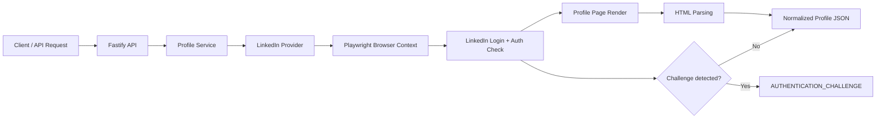

# ProfileLens API

ProfileLens is a TypeScript API that accepts a public LinkedIn profile URL and returns structured profile data from an authorized browser session. The project is designed around a legitimate browser-based extraction flow: the app logs in with real credentials in a local browser context, keeps that session alive while valid, and fails gracefully when LinkedIn triggers a security challenge instead of trying to bypass that protection.

## Current approach we are following

The current architecture is a local-browser authentication model:

1. Public API receives a profile URL.
2. Fastify validates the URL and routes the request to the profile service.
3. A Playwright browser context is created with the configured LinkedIn account.
4. The browser logs in to LinkedIn using credentials from environment variables.
5. The browser loads the requested profile page in an authenticated session.
6. The page HTML is parsed into a normalized profile object (name, headline, location, about, experience, education, skills, certifications, languages).
7. If LinkedIn shows a challenge such as authwall, security verification, or checkpoint, the app returns a controlled `AUTHENTICATION_CHALLENGE` rather than attempting to circumvent it.

This is the path currently implemented in the codebase and is the one we are using for the demo: local browser environment, stored session in memory, controlled login/retry behavior, no credential theft, no OTP bypass, no anti-bot workaround.

## What we tried before

We explicitly tested and rejected a few bad or fragile patterns during the development cycle:

- Attempt 1: One-off browser automation on every request.
  - Worked only for short-lived sessions.
  - Repeated login attempts were noisy and brittle.
  - LinkedIn security checks frequently interrupted the flow.

- Attempt 2: Shared login state without challenge handling.
  - Created session reuse logic but no graceful challenge detection.
  - When LinkedIn redirected to security verification, the app could not recover cleanly.

- Attempt 3: Hardcoded or hidden browser/session persistence.
  - Not suitable for a clean public deployment.
  - Risked leaving session or credential state in unsafe places.

- Attempt 4: Bypass or evade LinkedIn verification.
  - Not part of the final architecture.
  - It is explicitly not used and is not a valid path for this project.

The final approach is intentionally narrower and safer: authenticated browser access, challenge detection, graceful failure, and no anti-bot bypassing.

## How the system works

### API layer

- Fastify server runs on the local machine or deployed environment.
- Endpoint: `POST /v1/profile`
- Request body:

```json
{
  "url": "https://www.linkedin.com/in/example/"
}
```

- Response:

```json
{
  "data": {
    "profile_url": "https://www.linkedin.com/in/example/",
    "name": "Example Name",
    "headline": "Product Manager",
    "location": "Berlin, Germany"
  },
  "meta": {
    "source": "linkedin",
    "schema_version": "1.0",
    "cached": false,
    "fetched_at": "2026-08-31T00:00:00.000Z"
  }
}
```

### Browser and auth layer

The provider in `src/providers/linkedin.provider.ts` does the heavy lifting:

- Creates a browser or reuses a valid browser context.
- Opens the LinkedIn login page.
- Fills the configured email/password from `.env`.
- Detects authwall, security verification, checkpoint, or other sign-in challenges.
- If challenge appears, raises `AUTHENTICATION_CHALLENGE` and stops instead of trying to bypass it.
- Reuses the session while valid and invalidates/re-creates it when the session expires.

### Parsing layer

The HTML parser converts the loaded page into normalized profile data:

- `name`
- `headline`
- `location`
- `about`
- `profile_image_url`
- `experience`
- `education`
- `skills`
- `certifications`
- `languages`

This parsing is best-effort and depends on the exact structure LinkedIn renders for the account and profile.

## Local demo setup

Requirements: Node.js 20 LTS or newer.

```bash
npm install
npx playwright install chromium
cp .env.example .env
npm run dev
```

Then add the real local credentials in `.env`:

```env
LINKEDIN_EMAIL=your-email@example.com
LINKEDIN_PASSWORD=your-password
BROWSER_HEADLESS=false
```

Set `BROWSER_HEADLESS=false` when you want the browser window to be visible for a live demo. This is the most honest and explainable representation for a recorded walkthrough: a local browser session, real login, real challenge detection, controlled API output.

## Current demo flow to explain

Use this narrative when presenting the project:

> We are not trying to bypass LinkedIn’s security controls. Instead, we use a legitimate local browser environment with a real account session. The API validates the profile URL, opens a browser context, logs in, reuses the session when valid, and when LinkedIn triggers an identity check, it returns a clean challenge response. That keeps the system safe, transparent, and operationally honest.

Then explain the flow step-by-step:

1. Request comes in to the API.
2. Service validates and canonicalizes the profile URL.
3. Playwright authenticates using an existing session or a fresh local browser login.
4. Browser visits the page as an authorized user.
5. HTML is parsed into structured data.
6. Response is returned to the client.
7. If LinkedIn responds with verification, the system surfaces an `AUTHENTICATION_CHALLENGE` instead of trying to force through.

## Demo script (speaker notes)

> “The current architecture follows a legitimate local-browser session model. We accept a public LinkedIn profile URL, open an authorized browser context, login with the configured credentials, and parse the rendered profile into a structured JSON response. The key difference is that we do not bypass any LinkedIn verification process. If LinkedIn asks for additional verification, we stop with a clear challenge response so the system remains compliant and transparent.”

> “The service keeps the session in memory while it is valid, and it re-authenticates only when the session expires. This makes the system stable for a demo while preserving a clear failure mode when LinkedIn requires a human challenge.”

> “The reason we follow this model is simple: it works inside the platform’s own rules. We respect the login flow, detect the challenge early, and continue only when the account is actually authorized to access the profile.”

## Future options

These are the likely next evolutions, depending on the product direction:

### 1. Local browser worker with manual verification

- Best for demo and internal validation.
- Keeps a real authenticated browser session on a trusted machine.
- Good for quick proof-of-concept and human-readable walkthrough.
- Manual intervention is required when LinkedIn requests additional step-up verification.

### 2. Managed worker environment

- Run the browser in a persistent VM or container with access to real credentials.
- Keep session state in a secure environment rather than a public app runtime.
- Add health checks and challenge-aware retries.

### 3. Request broker pattern

- Public API stays stateless.
- A private worker handles LinkedIn access and returns only sanitized profile data.
- The user-facing API never touches the browser directly.

### 4. Hybrid storage and caching

- Cache normalized profile results by URL.
- Keep short-lived session reuse for performance.
- Keep challenge detection and explicit errors for security-sensitive flows.

### 5. Strict human-in-the-loop mode

- When the account hits a verification page, the flow pauses for a human operator.
- That human completes the required step on the local browser.
- The API resumes only once the session is cleared and valid again.

## Architecture summary



## Notes

- No credentials should be committed to GitHub.
- Keep `.env` local and secret.
- Do not store browser cookies or session files in the repository.
- LinkedIn access remains subject to account permissions, page availability, and security checks.
- The service is intentionally designed to fail safely and report `AUTHENTICATION_CHALLENGE` when verification is required.

## Deployment

1. Create a public GitHub repository and push this project.
2. In Render, create a new Web Service from the repository and choose Docker.
3. Add `LINKEDIN_EMAIL` and `LINKEDIN_PASSWORD` as deployment secrets.
4. Set the health check to `/health`.
5. Deploy and monitor for challenge responses.

Render may sleep free services, and the first request after a cold start may need re-authentication. The system is designed to return a controlled challenge rather than suppressing it.

## Environment

Copy `.env.example` to `.env` and adjust values as needed. Never commit credentials, cookies, or session state.
